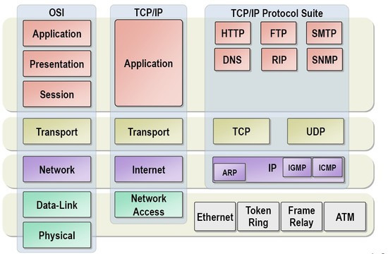

### 네트워크의 규칙
---
#### 프로토콜
- 프로토콜: 통신하기 위한 규칙
    - 한국인과 프랑스인이 영어로 대화한다는 규칙을 정해서 대화가 가능함 -> 서로 다른 컴퓨터가 통신 규칙을 정해서 통신이 가능함
- 일종의 편지 배송 과정
    - 편지 쓰기 ~ 편지 도착의 과정에서 규칙을 지키지 않으면 편지 배송이 불가능함
    - 편지를 쓰는 규칙, 편지를 보내는 규칙, 우체국의 규칙 등 각 규칙은 서로 영향을 주지 않음

#### OSI 7 layer & TCP/IP 4 layer 
- OSI: 네트워크 통신의 단계별 과정을 표준화한 개념적 모델. ISO 제정.

| 이름 | 역할 | 
| :--------: | :--------: | :-------- |
| 응용 | 사용자에게 네트워크 자원 제공 | 
| 표현 | 데이터 인코딩/디코딩, 암호화/복호화 | 
| 세션 | 세션관리, 연결유지/종료/방향관리 |
| 전송 | 신뢰성 보장, 흐름제어/분할/재조립/오류관리 |
| 네트워크 | 라우팅, 호스트 주소 관리 | 
| 데이터링크 | 물리장비 주소식별 | 
| 물리 | 물리적 매개 |

- TCP/IP: 네트워크 통신에 실제 사용되는 프로토콜의 모음. 미 국방부 제정.

#### 캡슐화와 역캡슐화
- 헤더: 데이터 전송 시 추가해야 하는 정보 
- 캡슐화: 데이터 전송 시 각 계층에서 헤더(데이터링크 계층의 트레일러도 포함)를 붙이는 작업
- 역캡슐화: 데이터 수신 시 각 계층에서 헤더(데이터링크 계층의 트레일러도 포함)를 떼는 작업